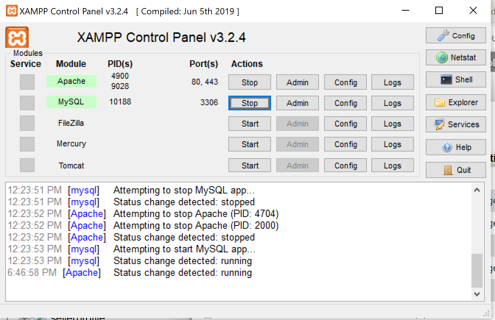
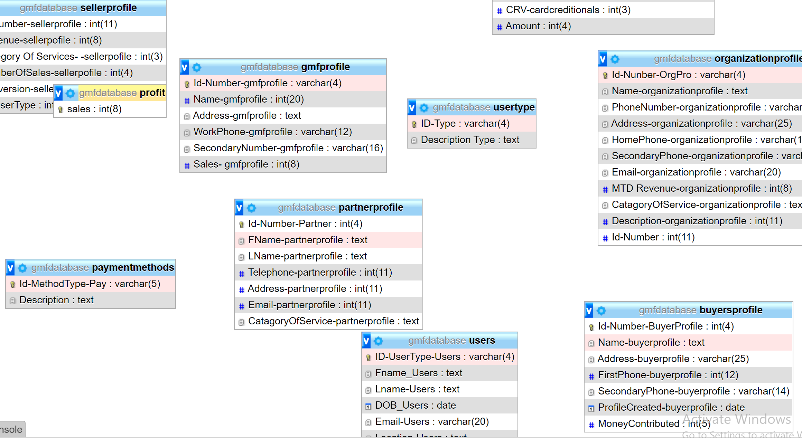

# Ecommerce fundraising platform

# Demo
https://njit-ecommerce.herokuapp.com/ deployed to Heroku
Description will go here 

# Installations and Technologies.
a.  Use the command `pip install`

b. `npm start`
c. addded `pip instal flask`
d. install lastest version of python
e. `import flask`
f. `flask_nysqldb import MySQL`
e . 'npm install --save react-animated-buttons'
## Database Setup
a.Xampp was used to run PHPMYAdmin the local drive making it easier to access, when the code is accessed by my collaborators.  Download your respective operating system and the latest version, and follow the steps on the screen.
 
Download XMAPP here: https://www.apachefriends.org/download.html
 
 Once app is downloaded, you have to turn on Apache and MYSQL in the application control panel. The control panel can be accessed in the directory folder where XMPP was downloaded. 

IMPORTANT: The server has to be able to access the server on the local computer through http://localhost/phpmyadmin. Every-time someone wants to use PHPadmin the servers must be turned on once again to get to the site and view the database tables.
 
 **Repeated Steps 12 times**
 After I got on PHP admin and followed my diagram, and created the tables with the primary key implemented in each table. 
 
 To implement the foreign keys it was more steps required.
 
Connect the entity diagram and I connected them by clicking on relationships and connecting the tables together by just clicking on the primary key and connecting it with another primary making the secondary table a foreign key that can be accessed in other to acess its attributes through another object.
 
Go into structure view-> relation review .
  
 
 Final Version  of SQL tables in PHPmyadmin.
 
 
b.  make sure the version of python in the system.
     Download Python here: https://www.python.org/
  
c. create classes with the attributes for insert, delete and modify.
d.create new tables to add additional feature for videos and images 
## API Keys
a.'add more info as we go here'
b. 'add more info as we go here''add more info as we go here'
c. 'add more info as we go here'

## Sign In Info
`Admin/Owner: `
 `email: admin@admin.com`
` password: admin1`
`Buyer:`
 `email: buyer@buyer.com`
 `password: buyer1`
`Nonprofit:`
 `email: nonprofit@nonprofit.com`
 `password: nonprofit`
`Sellers: `
 `email: seller@seller.com`
` password: seller`
